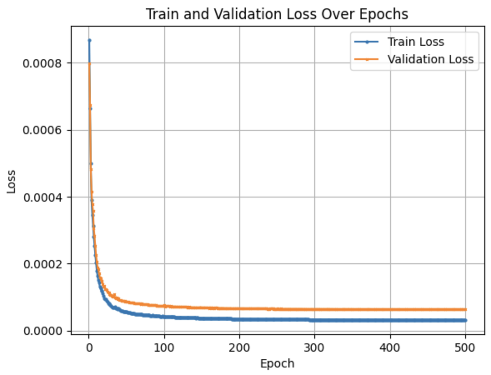

# white_balance_correction

White balance correction is a process used in photography and videography to ensure that colors appear natural and accurate in an image or video. The term "white balance" refers to the adjustment of colors in a way that white objects appear truly white, regardless of the lighting conditions under which the photo or video was taken.

Different light sources, such as sunlight, incandescent bulbs, or fluorescent lights, emit light with varying color temperatures. Without white balance correction, the colors in an image might appear too warm (yellowish) or too cool (bluish), depending on the lighting conditions.

White balance correction involves adjusting the relative intensity of different color channels (red, green, and blue) to neutralize any color cast caused by the lighting. This adjustment ensures that whites and other neutral tones in the image look neutral, improving the overall color accuracy and realism of the photograph or video. Most modern cameras and image editing software provide automatic white balance correction or manual controls for users to make these adjustments.

# Dataset
[Adobe White-Balanced Images Dataset](https://cvil.eecs.yorku.ca/projects/public_html/sRGB_WB_correction/dataset.html)

For experiments, Set 2 is considered. Set 2 contains 2,881 rendered images and the corresponding ground-truth images provided for testing on different camera models. This set includes images taken by four different mobile phones and one DSLR camera. 

# Approach

## Variational Autoencoder Model

### Encoder:

* The encoder consists of a series of convolutional layers followed by ReLU activation functions.
* Input to the encoder is a 3-channel image (presumably RGB), and it produces a feature representation.
* The convolutional layers downsample the input image through a series of convolution operations with stride 2, effectively reducing the spatial dimensions.
* The output of the convolutional layers is flattened into a 1D vector.
* Two linear layers (fc_mu and fc_logvar) produce the mean (mu) and log variance (logvar) of the latent space.

### Reparameterization:

* The reparameterize function takes the mean (mu) and log variance (logvar) as input.
* It generates a random tensor eps from a normal distribution and scales it by the standard deviation (std), which is the exponential of half the log variance.
* The result is added to the mean (mu) to obtain a sample from the latent space.

### Decoder:

* The decoder takes a sample from the latent space and reconstructs the input image.
* It consists of a series of linear and transposed convolutional layers followed by ReLU activation functions.
* The first linear layer expands the dimensionality of the latent space to match the flattened size before the flattening operation in the encoder.
* Subsequent transposed convolutional layers upsample the representation back to the original image dimensions.
* The final layer uses the Sigmoid activation function to ensure the pixel values of the output image are in the range [0, 1].

## Components of the Loss Function:

1. Reconstruction Loss (recon_loss): Measures the difference between the input and the reconstructed output, encouraging the model to generate outputs that closely resemble the input.
2. Kullback-Leibler Divergence (kl_divergence): Regularizes the latent space by encouraging its distribution to be close to a standard normal distribution.

## Hyper-parameters
learning rate = 1e-3
latent size = 128
batch size = 64
beta for KL-divergence = 0.00025

# Loss curves

{: width="300px"}

# Outputs

